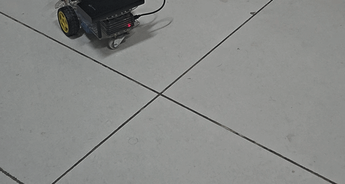

# esp32_ws — DiffBot ESP32 Firmware

Firmware for the ESP32 microcontroller that drives the **DiffBot** differential drive robot. Built with [PlatformIO](https://platformio.org/) and the Arduino framework.

This firmware runs on the robot's low-level compute layer and handles motor control, encoder reading, PID velocity control, and serial communication with the ROS2 middleware running on a Raspberry Pi 4.

> **Status:** MK1 active — closed loop velocity control working. MK2 hardware in design.

---

## Demo

### Robot Moving — Closed Loop Velocity Control


### RViz2 — Both Wheel TFs Tracking in Sync


---

## Hardware

| Component | Details |
|---|---|
| MCU | ESP32-WROOM-32E |
| Motors | DG01D-E TT motor with encoders |
| Encoder resolution | 1056 ticks/rev |
| Motor driver | L298N |
| On-board computer | Raspberry Pi 4 8GB (ROS2 Humble) |
| Communication | UART2 (GPIO16/17) at 115200 baud |
| Debug serial | USB (GPIO1/3) at 115200 baud |

### Pin Mapping

| Signal | GPIO |
|---|---|
| Motor Right IN1 | 25 |
| Motor Right IN2 | 26 |
| Motor Right ENA (PWM) | 27 |
| Motor Left IN1 | 12 |
| Motor Left IN2 | 13 |
| Motor Left ENA (PWM) | 14 |
| Right Encoder A | 32 |
| Right Encoder B | 33 |
| Left Encoder A | 34 |
| Left Encoder B | 35 |
| UART2 RX | 16 |
| UART2 TX | 17 |

> **Note:** GPIO34/35 are input-only pins with no internal pull-up resistors. External 1KΩ pull-up resistors to 3.3V are required on these pins since the DG01D-E encoder uses an open-drain NPN output.

---

## Architecture

```
ROS2 (RPi 4)
    │
    │  UART2 @ 115200 baud (/dev/serial0)
    │  Serial command protocol
    ▼
ESP32 Firmware
    ├── Serial command parser (64-byte frame buffer)
    ├── PID velocity controller (20 Hz)
    ├── PCNT hardware quadrature encoder reader
    ├── PWM motor driver (ledc, 1kHz, 8-bit)
    └── Watchdog (500ms timeout → motor stop)
```

### Control Loop

The PID control loop runs at **20 Hz** (50ms interval) using `micros()` for timing. Actual elapsed time is used for speed and PID calculations to eliminate timing jitter error.

**Encoder reading:** PCNT hardware counter is read then immediately cleared each cycle — the reading itself is the delta (ticks since last cycle). This prevents PCNT overflow and eliminates the subtract-previous approach.

**Speed measurement:** Raw ticks/sec is passed through an IIR low-pass filter (α=0.6) to smooth encoder quantisation noise before feeding the PID controller.

**PWM mapping:** PID output in ticks/sec is linearly mapped to PWM range [180, 255]. The `min_pwm=180` threshold overcomes motor stiction at low speeds.

---

## Serial Command Protocol

Commands are sent over UART2, terminated with `\r\n`.

| Command | Format | Response |
|---|---|---|
| Set motor speeds | `m <left_ticks/s> <right_ticks/s>` | `OK` |
| Read encoders | `e` | `<left_count> <right_count>` |
| Reset encoders | `r` | `OK` |
| Set left PID | `l <Kp> <Ki> <Kd>` | `LEFT PID UPDATED: x, x, x` |
| Set right PID | `n <Kp> <Ki> <Kd>` | `RIGHT PID UPDATED: x, x, x` |
| Ping | `p` | `OK` |

**Watchdog:** If no `m` command is received for 500ms, motors stop and all PID state resets automatically.

---

## PID Configuration

| Parameter | Value | Notes |
|---|---|---|
| `MAX_TICKS_PER_SEC` | 250 | Measured physical max at current supply voltage |
| `Kp` default | 1.0 | Proportional gain |
| `Ki` default | 0.0 | Tune after Kp is stable |
| `Kd` default | 0.0 | Optional — tune last |
| `KP_MAX` | 2.0 | Runtime validated max |
| `KI_MAX` | 0.5 | Runtime validated max |
| `MAX_INTEGRAL_TICKS` | 250 | Windup limit proportional to speed range |

PID gains can be updated live via serial without reflashing:
```bash
echo -e "l 1.0 0.3 0.0\r" > /dev/serial0   # left motor
echo -e "n 1.0 0.3 0.0\r" > /dev/serial0   # right motor
```

---

## Debug Output — Teleplot Format

Debug data is printed on the USB serial port in [Teleplot](https://marketplace.visualstudio.com/items?itemName=alexnesnes.teleplot) format for live plotting in VSCode:

```
>SP_L:200.0
>SP_R:200.0
>M_L:197.3
>M_R:199.1
>PWM_L:245
>PWM_R:243
```

---

## Getting Started

### Prerequisites
- [PlatformIO](https://platformio.org/install) (VS Code extension or CLI)

### Build and Flash
```bash
git clone https://github.com/Sreerajvr172001/esp32_ws.git
cd esp32_ws
git checkout pcnt-integration
pio run --target upload
pio device monitor --baud 115200
```

### Live PID Tuning
```bash
# Terminal 1 — continuous motor command (keeps watchdog fed)
while true; do echo -e "m 200 200\r" > /dev/serial0; sleep 0.1; done

# Terminal 2 — update PID live and listen for acknowledgements
cat /dev/serial0 &
echo -e "l 1.0 0.3 0.0\r" > /dev/serial0
echo -e "n 1.0 0.3 0.0\r" > /dev/serial0
```

---

## Known Issues

| Issue | Status |
|---|---|
| Left encoder intermittent — open-drain encoder on GPIO34/35 needs external 1KΩ pull-up resistors to 3.3V | 🔧 Hardware fix pending |
| Encoder quantisation noise at low tick counts limits PID precision on MK1 | ⚠️ Hardware limitation — resolves with MK2 higher CPR motor |

---

## Roadmap

| Version | Hardware | Status |
|---|---|---|
| MK1 (current) | DG01D-E TT motors, L298N, 2S 18650 | ✅ Working |
| MK2 | Cytron SPG30E-60K (420 CPR), Cytron MDD10A, 3S LiPo, custom acrylic chassis | 📋 Chassis design in progress |
| MK3 | Jetson Orin Nano Super, OAK-D Lite AF, BNO085 IMU, NVMe SSD | 📋 Planned |

---

## Related Repository

ROS2 middleware that communicates with this firmware:
👉 [diffdrive_esp32](https://github.com/Sreerajvr172001/diffdrive_esp32)

---

## License

Copyright 2025 Sreeraj V R. Licensed under the [Apache License 2.0](LICENSE).

---

## Author

**Sreeraj V R**
Engineer (Grade II), BEML Ltd R&D | Robotics
[LinkedIn](https://linkedin.com/in/sreerajvr172001) · [GitHub](https://github.com/Sreerajvr172001)
